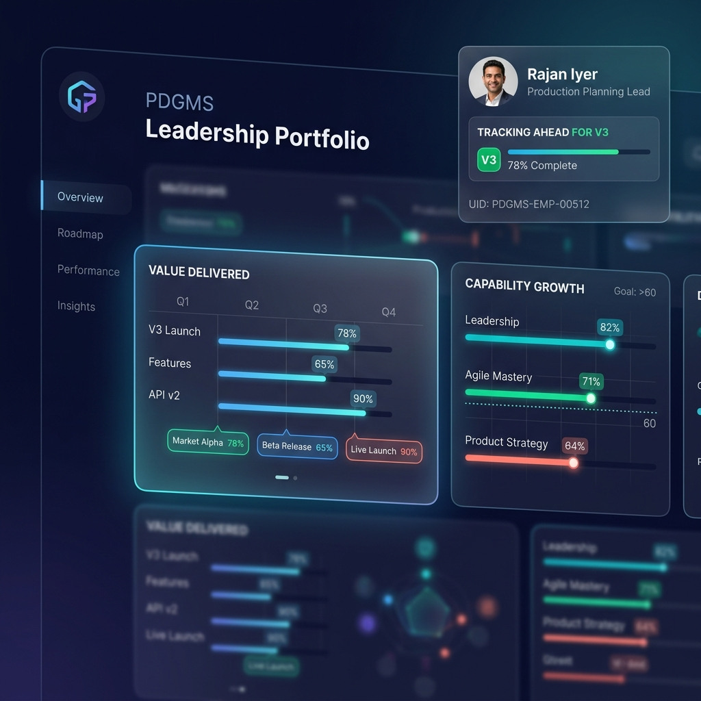

# Walkthrough: Repository Cleanup & Leadership Portfolio Redesign



We have cleaned up the repository to isolate the Product Management assignment, and built a fully functional interactive prototype for the **Leadership Portfolio Redesign**!

---

## 🛠️ Actions Taken

1. **Repository Isolation:**
   - Deleted all unrelated hiring assignments (React Developer, Java Backend, Software Developer, Finance, Psychology, Business Analytics, etc.) and their files from the repository root.
   - Kept only the `/productmanagement` folder and the `.git` metadata.

2. **Prototype Web Application:**
    - **`index.html`:** Clean, semantic structure containing the redesigned portfolio as a unified dark-themed career pitch deck.
    - **`style.css`:** Premium visual design system built using CSS variables, HSL color palettes, glassmorphic translucent panels, Outfit and Inter typography, responsive layout grid (960px max-width), and smooth micro-animations.
    - **`app.js`:** Loads `mock-portfolio-data.json` dynamically via fetch, maps data values to UI components, and manages interactive states (e.g. details drawers, target gauges, and career path runway).

3. **Design Strategy:**
   - **`design_rationale.md`:** Detailed rationale documenting how we solved the 5 PM design challenges (Executive signal, story vs. data ordering, section layouts, constraint re-framing, and portability).

---

## 🔍 How to Run and Verify the Prototype

Since the application is built entirely as a static client-side web page, you can open and run it directly in your browser:

### Option A: Open directly via File URI
Open your browser and navigate to:
[index.html](file:///home/rushi/DT/index.html)

### Option B: Run a local Python web server
You can spin up a lightweight HTTP server in the project directory using:
```bash
python3 -m http.server 8000
```
Then visit `http://localhost:8000` in your web browser.

---

## 📋 Verification & UX Results

- **Narrative-First Signal:** The hero section leads with a scannable score ring (71/100), levels V2 ➔ V3, pace badge (Ahead of Plan), and a clear executive summary sentence.
- **Visual Metering:** The capability scores (Growth Profile) show clear vertical progress bars with color-coded alerts (green/amber) and goals.
- **Interactive Details:** Clicking "View all deliverables" smoothly expands the deliverables list under the Delivered card.
- **Obstacle Resolution:** The "Challenges" section displays a summary of resolution metrics ("5 resolved · 3 open · 62% resolution") and details each logging event, with resolved items visually dimmed to highlight open issues.
- **Career Path runway:** Renders a clean visual timeline indicating historical milestones, current standing, and future targets, alongside gap driver highlights below.
